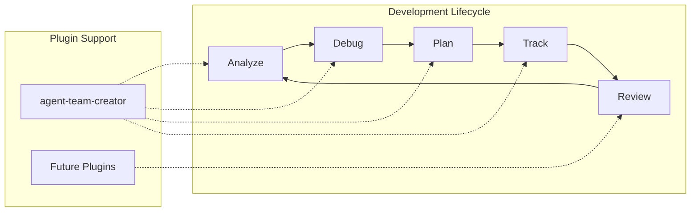
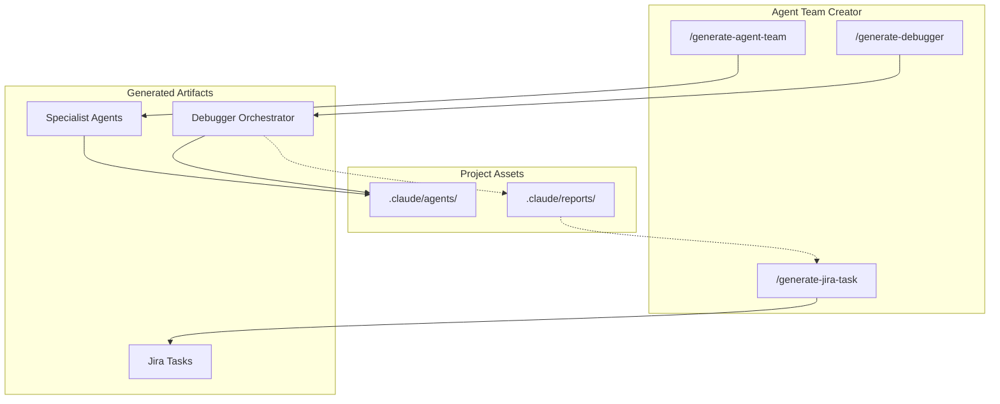
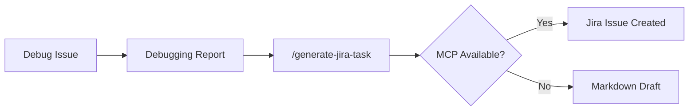
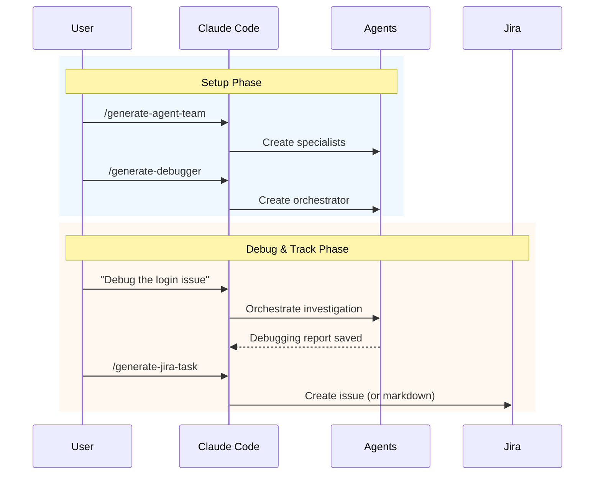

# Claude Code Plugins

A collection of Claude Code plugins for software development lifecycle improvement.

> **Quality Marketplace** - Curated plugins that enhance Claude Code with specialized capabilities for code analysis, debugging, project management, and development workflow automation.

---

## Vision



This marketplace provides plugins that augment Claude Code throughout the software development lifecycle:

| Phase | Current Support | Future Plugins |
|-------|-----------------|----------------|
| **Analyze** | `/generate-agent-team` - Create domain experts | Code metrics, dependency analysis |
| **Debug** | `/generate-debugger` - Orchestrated investigation | Performance profiling, log analysis |
| **Plan** | Implementation planning agents | Sprint planning, estimation |
| **Track** | `/generate-jira-task` - Issue creation | Multi-tracker support, status sync |
| **Review** | Debugging reports with solutions | PR review, code quality gates |

---

## Available Plugins

### agent-team-creator

Automatically analyze your codebase and generate a team of specialized Claude Code agents that are experts on your specific project.



**Features:**
- Deep codebase analysis (tech stack, architecture, patterns)
- Dynamic team generation based on project complexity
- Project-specific debugging with orchestration patterns
- Jira integration for issue tracking
- Agents saved directly to `.claude/agents/` for immediate use

**Commands:**

#### `/generate-agent-team`
Analyze your project and create specialized agents based on:
- Tech stack (frameworks, libraries, languages)
- Architecture patterns (monolith, microservices, etc.)
- Domain knowledge (business logic, data models)

#### `/generate-debugger`
Generate a project-specific debugger agent that:
- Discovers all existing project agents in `.claude/agents/`
- Creates orchestration patterns tailored to YOUR project architecture
- Coordinates investigation by delegating to specialist agents
- Produces structured reports with:
  - Root cause analysis
  - Investigation trail (which agents were consulted)
  - Side effects and warnings
  - Solutions ordered by effort (quick/proper/comprehensive)
- **Saves reports** to `.claude/reports/debugging/` for downstream processing

#### `/generate-jira-task`
Transform debugging reports into well-structured Jira tasks:
- Reads debugging reports from `.claude/reports/debugging/`
- Invokes `implementation-planner` agent for fix design
- Invokes `jira-writer` agent for Jira formatting
- Creates issues via Atlassian MCP (or markdown fallback)
- Includes: summary, description, acceptance criteria, labels



**Core Debugger Rules:**
- Coordinates, doesn't implement - delegates to specialists
- Evidence-based - requires file:line references
- Synthesizes findings across agents
- Considers system-wide impact

[View plugin details](./agent-team-creator/README.md)

---

## Plugin Roadmap

Planned plugins to extend the Quality Marketplace:

| Plugin | Purpose | Status |
|--------|---------|--------|
| `agent-team-creator` | Codebase analysis, agent generation, debugging, Jira | **Available** |
| `pr-review-toolkit` | Code review automation, PR analysis | Planned |
| `test-coverage-analyzer` | Test gap detection, coverage reports | Planned |
| `dependency-auditor` | Security scanning, update recommendations | Planned |
| `performance-profiler` | Bottleneck detection, optimization suggestions | Planned |
| `documentation-generator` | API docs, architecture diagrams | Planned |

---

## Installation

### 1. Add this marketplace

```bash
/plugin marketplace add Cpicon/claude-code-plugins
```

### 2. Install a plugin

```bash
/plugin install agent-team-creator
```

### 3. Use the plugin

Navigate to any project directory and run:

```bash
# Generate specialized agents for your project
/generate-agent-team

# Generate a project-specific debugger
/generate-debugger

# Create Jira task from debugging report
/generate-jira-task
```

---

## Workflow Example



---

## Updating

To get the latest version of plugins:

```bash
/plugin marketplace update
```

---

## Documentation

- [Plugin Development Guide](./docs/PLUGIN-DEVELOPMENT-GUIDE.md) - Templates and patterns for creating plugins
- [Testing Guide](./docs/TESTING-GUIDE.md) - How to test plugin workflows
- [Plugin Development Lessons](./docs/plugin-development-lessons.md) - Issues encountered and lessons learned

---

## Contributing

Contributions are welcome! Please feel free to submit issues or pull requests.

### Adding a New Plugin

1. Review the [Plugin Development Guide](./docs/PLUGIN-DEVELOPMENT-GUIDE.md)
2. Create your plugin directory with `plugin.json`
3. Add commands, agents, and skills as needed
4. Test using the workflow in [Testing Guide](./docs/TESTING-GUIDE.md)
5. Submit a PR

---

## License

MIT License - see [LICENSE](./LICENSE) for details.

---

## Author

**Christian Picon Calderon**
- GitHub: [@Cpicon](https://github.com/Cpicon)
- Email: c.picon@uniandes.edu.co
