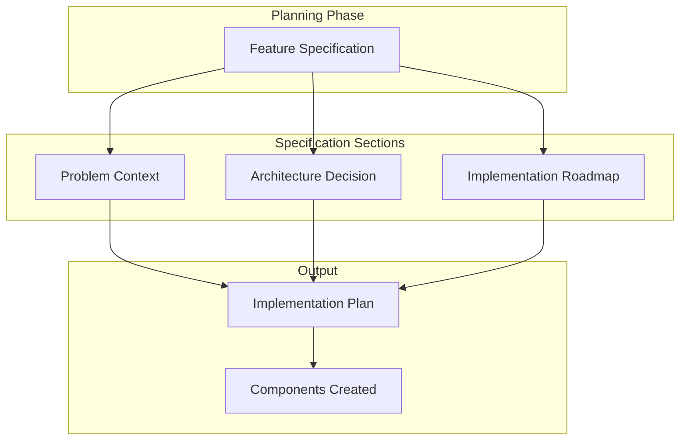
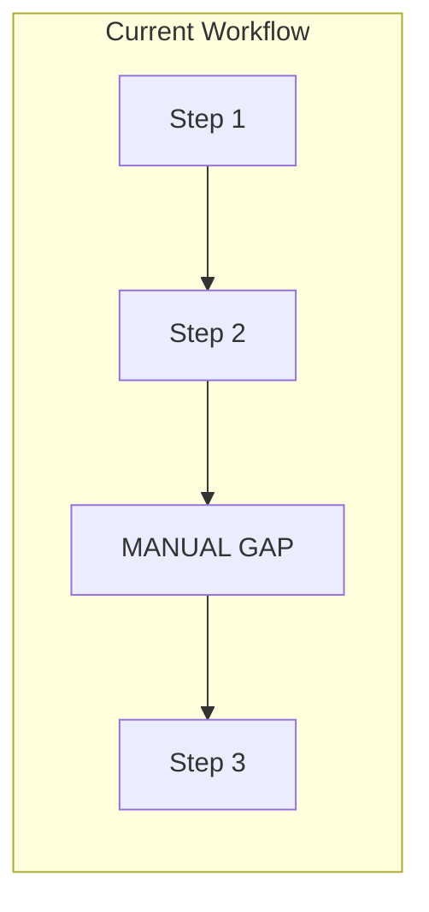
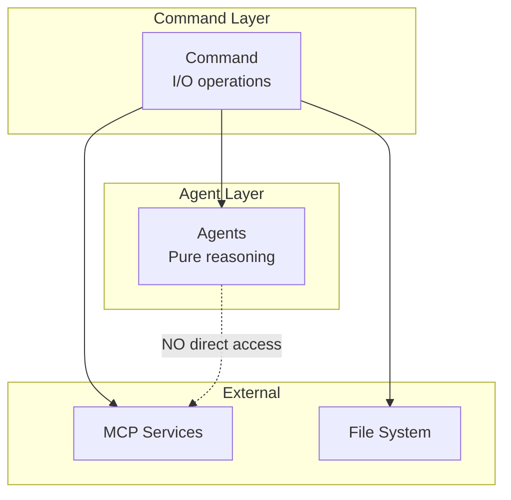
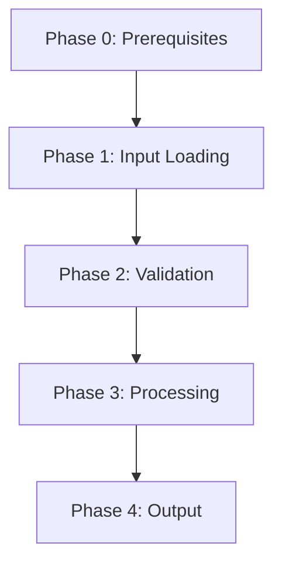

# Plugin & Command Development Guide

> A guide for creating new plugins, commands, and features for Claude Code using structured documentation.

---

> **Document Metadata**
> - **Created**: 2026-01-04
> - **Updated**: 2026-01-04
> - **Claude Code Version**: As of January 2026
> - **Status**: Active
>
> ⚠️ **Version Notice**: Claude Code is actively developed. Technical assumptions in this document
> should be validated against current behavior when starting new plugin development. Check the
> [Technical Findings](#technical-findings-claude-code-internals) section for known limitations.

---

## Overview

This guide provides templates and patterns for documenting plugin development. Following this structure enables:
- Clear communication of problem and solution
- Structured implementation planning
- Effective collaboration with LLMs for implementation

---

## Document Relationship



A single **Feature Specification** document contains three major sections:
1. **Problem Context** - What problem we're solving and why
2. **Architecture Decision** - How we'll solve it technically
3. **Implementation Roadmap** - Phase-by-phase execution plan

---

## Feature Specification Template

### Metadata Header (Required)

```markdown
# Feature Name: [Descriptive Title]

> **File**: `feature-name-spec.md`
> **Created**: YYYY-MM-DD
> **Updated**: YYYY-MM-DD
> **Status**: [Planning | In Progress | Complete]
> **Plugin**: `plugin-name`
> **Author**: [Name]
```

**Status Values**:
| Status | Meaning |
|--------|---------|
| Planning | Problem defined, solution being designed |
| In Progress | Implementation started |
| Complete | Feature shipped and tested |

---

## Section 1: Problem Context

### 1.1 Plugin Overview

```markdown
## Plugin Overview

### What Is This Plugin?

[1-2 paragraph description of the plugin's purpose and value proposition]

### Current Status

| Component | Status | Description |
|-----------|--------|-------------|
| `/command-1` | ✅ Complete | [Brief description] |
| `/command-2` | 🔧 In Development | [Brief description] |
| `agent-name` | ✅ Complete | [Brief description] |
| `skill-name` | 📋 Planned | [Brief description] |

### Plugin Structure

[Directory tree showing current structure]
```

### 1.2 Workflow Gap Analysis



**Template**:

```markdown
## The Gap

### Current Workflow

[Describe what happens today step-by-step]

### The Problem

| Problem | Impact |
|---------|--------|
| [Problem 1] | [Business/user impact] |
| [Problem 2] | [Business/user impact] |

### Proposed Workflow

[Describe the improved flow with the new feature]
```

### 1.3 Success Criteria

```markdown
## Success Criteria

| Criteria | Current | Target |
|----------|---------|--------|
| [Metric 1] | [Current value] | [Target value] |
| [Metric 2] | [Current value] | [Target value] |
```

---

## Section 2: Architecture Decision

### 2.1 Architecture Pattern



**Template**:

```markdown
## Architecture Decision

### Pattern: [Pattern Name]

[1-2 sentences explaining why this pattern was chosen]

### Responsibilities

| Layer | Handles | Does NOT Handle |
|-------|---------|-----------------|
| Command | [List] | [List] |
| Agent | [List] | [List] |

### Diagram

[ASCII or Mermaid diagram showing architecture]
```

### 2.2 Technical Constraints

```markdown
## Constraints

### Technical Constraints

| Constraint | Impact | Workaround |
|------------|--------|------------|
| [Constraint] | [How it limits us] | [How we handle it] |

### Workflow Constraints

| Constraint | Decision |
|------------|----------|
| [Constraint] | [What we decided] |

### Out of Scope

| Feature | Reason |
|---------|--------|
| [Feature] | [Why not included] |
```

### 2.3 Architecture Decisions Log

```markdown
## Architecture Decisions Log

| Decision | Date | Choice | Rationale |
|----------|------|--------|-----------|
| [Topic] | YYYY-MM-DD | [What was decided] | [Why] |
```

---

## Section 3: Implementation Roadmap

### 3.1 Component Inventory

```markdown
## Components

### Commands

| Command | Purpose | Status |
|---------|---------|--------|
| `/command-name` | [What it does] | CREATE |

### Agents

| Agent | Purpose | MCP Needed? | Status |
|-------|---------|-------------|--------|
| `agent-name` | [What it does] | Yes/No | CREATE/EXISTS |

### Skills

| Skill | Purpose | Status |
|-------|---------|--------|
| `skill-name` | [What it does] | CREATE/EXISTS |
```

### 3.2 Command Workflow Phases



**Template for each phase**:

```markdown
### Phase N: [Phase Name] ([Owner] - [Type])

**Purpose**: [What this phase accomplishes]

**Inputs**:
- [Input 1]
- [Input 2]

**Process**:
1. [Step 1]
2. [Step 2]

**Outputs**:
- [Output 1]

**Validation**:
- [Check 1]
- [Check 2]

**Error Handling**:
| Error | Recovery |
|-------|----------|
| [Error type] | [What to do] |
```

### 3.3 Agent Specification Template

```markdown
## Agent: `agent-name`

### Metadata

| Field | Value |
|-------|-------|
| Location | `plugin/agents/agent-name.md` |
| Tools | Read, Grep, Glob |
| MCP Required | No |

### Description

[When to use description with example triggers]

### Core Responsibilities

1. [Responsibility 1]
2. [Responsibility 2]

### Input Format

[What the agent expects as input]

### Output Format

[Exact structure the agent must produce]

### Frontmatter

```yaml
---
name: agent-name
description: [Full description with examples]
model: inherit
color: [color]
tools:
  - Read
  - Grep
  - Glob
---
```
```

### 3.4 Command Specification Template

```markdown
## Command: `/command-name`

### Metadata

| Field | Value |
|-------|-------|
| Location | `plugin/commands/command-name.md` |
| Argument | `[optional-arg]` |

### Allowed Tools

- Read, Write, Glob, Grep
- Task (for agent invocation)
- AskUserQuestion
- [MCP tools if needed]

### Phases

[Reference phase breakdown from 3.2]

### Fallback Mode

[What happens when external services unavailable]

### Frontmatter

```yaml
---
name: command-name
description: [Brief description]
allowed-tools:
  - Read
  - Write
  - Task
  - [...]
argument-hint: "[description]"
---
```
```

### 3.5 Implementation Sprints

```markdown
## Implementation Order

### Sprint 1: MVP
- [ ] [Task 1]
- [ ] [Task 2]

### Sprint 2: Integration
- [ ] [Task 1]
- [ ] [Task 2]

### Sprint 3: Polish
- [ ] [Task 1]
- [ ] [Task 2]
```

### 3.6 Risk Analysis

```markdown
## Risk Analysis

| Risk | Severity | Likelihood | Mitigation |
|------|----------|------------|------------|
| [Risk] | LOW/MED/HIGH | LOW/MED/HIGH | [How to handle] |
```

---

## Patterns & Best Practices

### Hybrid Architecture Pattern

When building features that need external services:

```
COMMAND (I/O Layer)
├── Handles: MCP calls, file operations, user interaction, caching
├── Invokes: Agents for reasoning tasks
└── Owns: Validation, error recovery, output

AGENT (Intelligence Layer)
├── Handles: Analysis, reasoning, formatting
├── Receives: Text input from command
└── Returns: Structured text output
```

**Why**: Plugin-defined agents cannot reliably access MCP tools. Keep I/O at command level.

### Phase-Based Execution

Break complex workflows into numbered phases:

1. **Phase 0**: Prerequisites/availability checks
2. **Phase 1-N**: Core workflow steps
3. **Final Phase**: Output generation

Each phase should:
- Have clear inputs and outputs
- Include validation
- Define error handling
- Specify the owner (Command vs Agent)

### Fallback Mode Pattern

Always design for graceful degradation:

```
Check service availability
    ├── Available → Normal mode
    └── Unavailable → Fallback mode
        ├── Skip service-dependent phases
        ├── Continue with local-only phases
        └── Generate offline-compatible output
```

### Data Flow Between Phases

```
Phase N output → Validation → Phase N+1 input
```

Always validate between phases to catch issues early.

### Agent Invocation Pattern

```markdown
Use the Task tool with:
- subagent_type: "plugin-name:agent-name"
- prompt: [Formatted input content]
- description: "Brief description"

Wait for agent to complete and receive output.

Validate output contains required sections.
```

---

## Technical Findings: Claude Code Internals

> ⚠️ **Important**: These findings document Claude Code behavior as of January 2026.
> Validate assumptions before starting new development, as the tool evolves.

### Validated Assumptions

| Assumption | Result | Evidence |
|------------|--------|----------|
| Command → Agent invocation | ✅ WORKS | Task tool available in commands |
| Agent → Agent invocation | ⚠️ 1-LEVEL ONLY | "Subagents cannot spawn subagents" |
| Plugin agents → MCP tools | 🔴 BUG | GitHub #13605, #15810 - unreliable |

### Key Limitation: MCP Tool Access Bug

Multiple GitHub issues report that **plugin-defined agents cannot reliably access MCP tools**:
- [Issue #13605](https://github.com/anthropics/claude-code/issues/13605): Custom plugin subagents cannot access MCP tools
- [Issue #15810](https://github.com/anthropics/claude-code/issues/15810): Subagents not inheriting MCP tools

**Solution**: Keep all MCP operations at the command level, where they work reliably.

### Command Execution Model

When a user runs `/plugin-name:command-name`:

1. **Claude Code loads the command file** (`command-name.md`)
2. **Command markdown becomes Claude's context** - The instructions are the system prompt
3. **Claude follows instructions using `allowed-tools`** - Including MCP tools for I/O
4. **Agent invocation uses Task tool** with specific `subagent_type`

### Task Tool Subagent Syntax

**Pattern**: `{plugin-name}:{agent-name}`

| Agent | subagent_type Example |
|-------|----------------------|
| implementation-planner | `agent-team-creator:implementation-planner` |
| jira-writer | `agent-team-creator:jira-writer` |
| custom-agent | `your-plugin:custom-agent` |

**Example Task invocation in command**:
```markdown
Use the Task tool with subagent_type="plugin-name:agent-name"
to analyze the input and generate structured output.
```

### Agent Output Handling

When a command invokes an agent via the Task tool:

1. **Agent execution**: The agent runs with its own context and tools
2. **Output return**: Agent's response (markdown text) is returned to the command
3. **Command receives text**: The complete agent output becomes available as text
4. **Command validates**: Parse output for required sections using markdown patterns
5. **Command continues**: Use validated output as input to next phase

### Data Flow Between Phases

```
Phase N: Load Data (File Read) ─────────────────────────────────┐
         └─ data_content (string)                                │
                                                                 │
Phase N+1: Task(reasoning-agent) ◄───────────────────────────────┤
         │   Input: data_content                                 │
         └─ agent_output (string) ───────────────────────────────┤
                                                                 │
         ┌─ CONCATENATION STEP (command formats input) ──────────┤
         │   Format: "## Section A\n\n{data}\n\n                 │
         │            ## Section B\n\n{output}"                  │
         └─ combined_input (string) ─────────────────────────────┤
                                                                 │
Phase N+2: Task(formatting-agent) ◄──────────────────────────────┤
         │   Input: combined_input (formatted as shown above)    │
         └─ formatted_output (string) ───────────────────────────┤
                                                                 │
Phase N+3: Create Output (MCP or File) ◄─────────────────────────┘
         │   Input: formatted_output (parsed for fields)
         └─ result (success/failure)
```

### Validation Pattern (Command-Level)

```markdown
After invoking agent, check output contains:
- Required headers (## Section Name)
- Required fields (**Field:**)
- Non-empty content blocks
If missing, warn user and offer to abort or continue.
```

### Subagent Nesting Limitation

Claude Code restricts subagent depth to **one level**:
- ✅ Command → Agent (works)
- ❌ Command → Agent → Agent (blocked: "Subagents cannot spawn subagents")

**Workaround**: If complex orchestration is needed, have the command invoke multiple agents sequentially rather than having agents invoke each other.

### Known Working vs. Unreliable Patterns

| Pattern | Status | Notes |
|---------|--------|-------|
| Command → MCP tools | ✅ Works | Use `allowed-tools` in command frontmatter |
| Command → Task (agent) | ✅ Works | Use `subagent_type: "plugin:agent"` |
| Command → Read/Write/Glob | ✅ Works | Standard file operations |
| Agent → Read/Grep/Glob | ✅ Works | Pure file operations in agents |
| Agent → MCP tools | 🔴 Bug | Unreliable, avoid in plugin agents |
| Agent → Task (sub-agent) | ❌ Blocked | "Subagents cannot spawn subagents" |

---

## Checklist: Feature Specification

Before implementation, verify your spec includes:

### Problem Context
- [ ] Plugin overview with current status
- [ ] Workflow gap analysis (current vs proposed)
- [ ] Problem impact table
- [ ] Success criteria with metrics

### Architecture
- [ ] Architecture pattern with diagram
- [ ] Technical constraints with workarounds
- [ ] Out of scope list
- [ ] Architecture decisions log

### Roadmap
- [ ] Component inventory (commands, agents, skills)
- [ ] Phase-by-phase workflow
- [ ] Agent specifications with I/O formats
- [ ] Command specifications with allowed tools
- [ ] Sprint breakdown
- [ ] Risk analysis

---

## Quick Reference

### Command Frontmatter

```yaml
---
name: command-name
description: Brief description
allowed-tools:
  - Read
  - Write
  - Glob
  - Grep
  - Task
  - AskUserQuestion
argument-hint: "[optional-argument]"
---
```

### Agent Frontmatter

```yaml
---
name: agent-name
description: |
  Use this agent when [trigger conditions].
  Examples: "do X", "help with Y"
model: inherit
color: cyan
tools:
  - Read
  - Grep
  - Glob
---
```

### Agent Invocation

```markdown
Use the Task tool with:
- subagent_type: "plugin-name:agent-name"
- prompt: [input content]
```

### Validation Pattern

```markdown
After receiving output, verify:
- Required section exists: `## Section Name`
- Required field exists: `**Field:**`
- Content is non-empty

If validation fails:
- Log warning with details
- Ask user to proceed or abort
```
