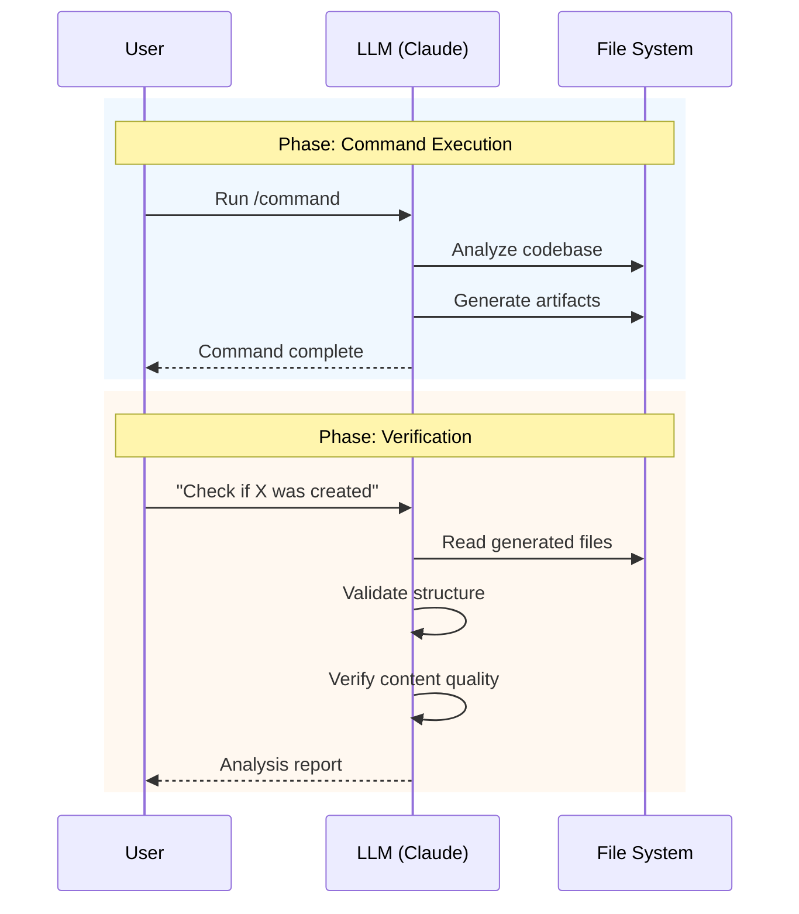
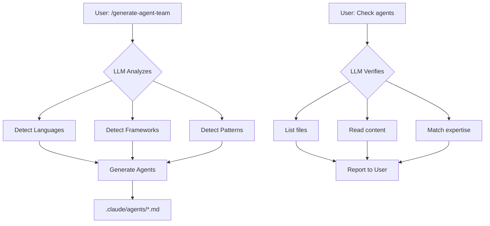
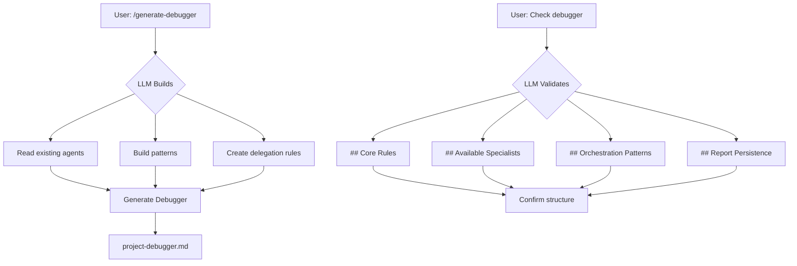
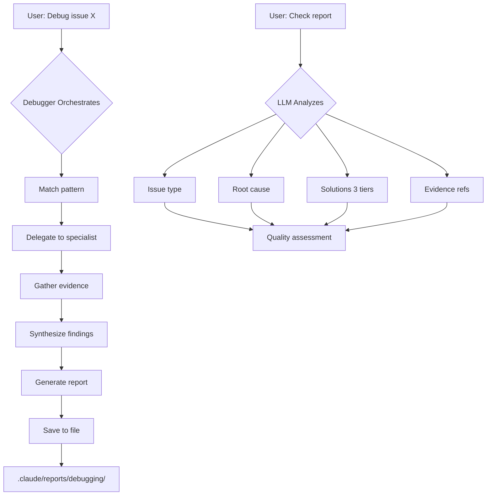
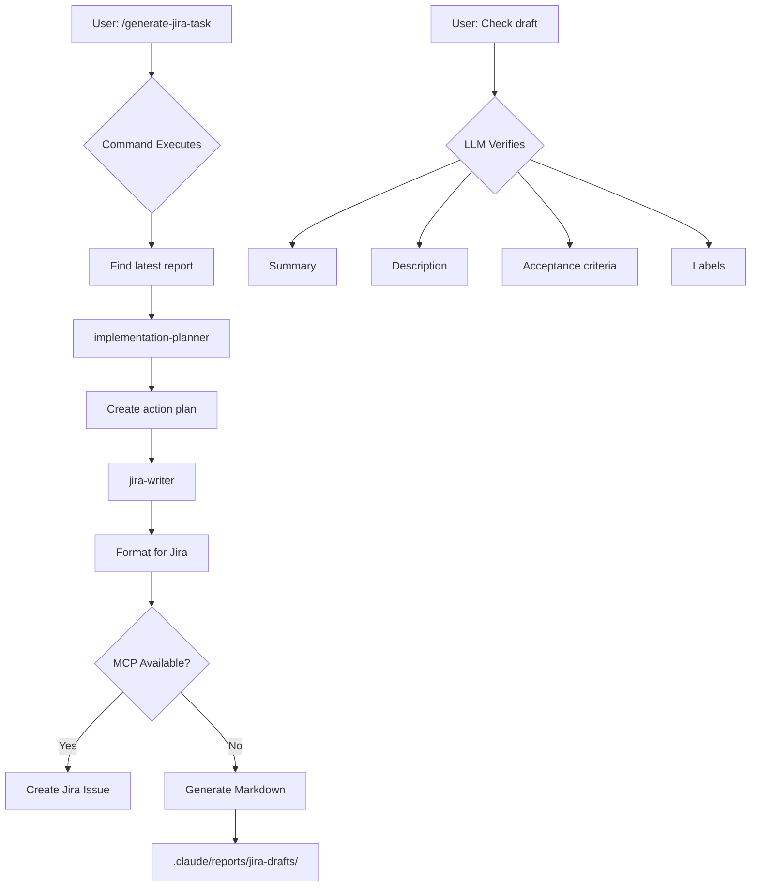
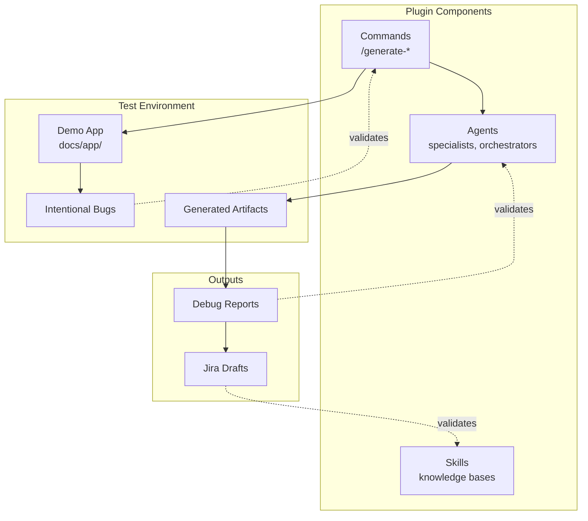
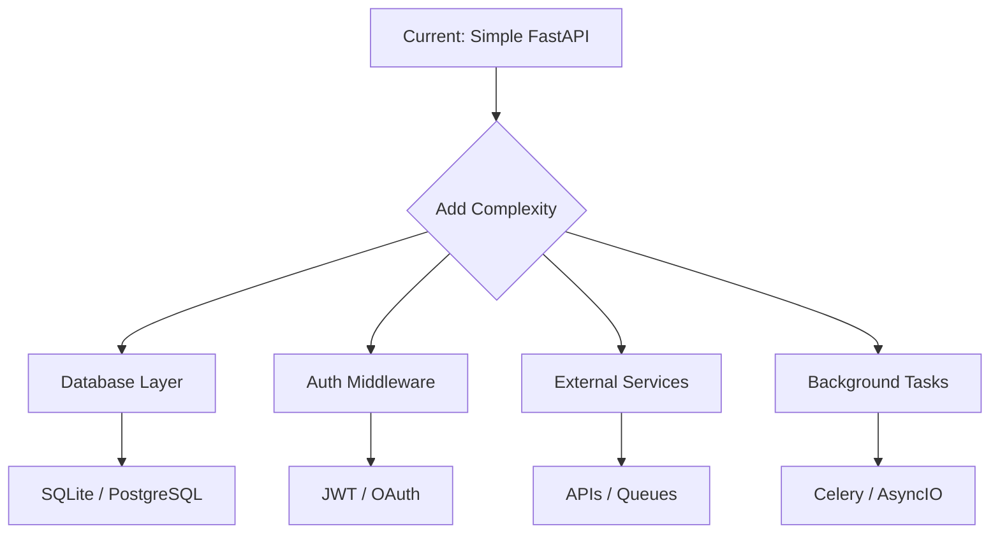

# Plugin Testing & Contribution Guide

> A guide for testing the `agent-team-creator` plugin and contributing new test scenarios.

---

## Quick Start

```bash
cd docs/app
```

Then run commands in Claude Code to test the plugin workflow.

---

## Workflow Overview

```mermaid
flowchart LR
    subgraph Setup
        A[Navigate to docs/app]
    end

    subgraph "Agent Generation"
        B[/generate-agent-team]
        C[/generate-debugger]
    end

    subgraph "Debug Workflow"
        D[Debug Issue]
        E[Report Saved]
    end

    subgraph "Jira Integration"
        F[/generate-jira-task]
        G[Jira Draft]
    end

    A --> B --> C --> D --> E --> F --> G
```

---

## User-LLM Interaction Pattern

This diagram shows the general interaction pattern between user and LLM during testing:



---

## User-LLM Interaction Workflow

This section documents the general interaction pattern when testing plugin features. This workflow applies to any test case.

### Phase 1: Environment Setup

**User action**: Navigate to test environment
```bash
cd docs/app
```

**LLM verification**: None required - user initiates

---

### Phase 2: Generate Specialist Agents



**User runs**:
```
/agent-team-creator:generate-agent-team
```

**LLM performs**:
- Analyzes codebase structure (languages, frameworks, patterns)
- Identifies domain boundaries
- Generates specialized agents in `.claude/agents/`

**User verification request**:
> "Check if the agents were created accordingly"

**LLM checks**:
- Lists files in `.claude/agents/`
- Reads each agent file
- Verifies agent expertise matches codebase
- Confirms all expected agents exist

---

### Phase 3: Generate Debugger Orchestrator



**User runs**:
```
/agent-team-creator:generate-debugger
```

**LLM performs**:
- Reads all existing agents
- Builds orchestration patterns based on agent expertise
- Generates `project-debugger.md` with delegation rules

**User verification request**:
> "Check the debugger definition if it makes sense"

**LLM checks**:
- Reads `project-debugger.md`
- Verifies required sections exist:
  - `## Core Rules`
  - `## Available Specialists`
  - `## Debugging Orchestration Patterns`
  - `## Report Persistence`
  - `## Mandatory Output: Debugging Report`
- Confirms specialist table matches generated agents
- Validates orchestration patterns reference real agents

---

### Phase 4: Debug an Issue



**User runs** (example):
```
Debug the email duplicate issue - users can register with the same email
```

**LLM performs**:
- Matches issue to orchestration pattern
- Delegates to appropriate specialist agent(s)
- Gathers evidence with file:line references
- Produces structured debugging report
- Saves report to `.claude/reports/debugging/report-{timestamp}.md`

**User verification request**:
> "Check the report that was created"

**LLM checks**:
- Finds report in `.claude/reports/debugging/`
- Reads report content
- Analyzes:
  - Issue type classification
  - Root cause identification
  - Solution quality (3 tiers)
  - Evidence references

---

### Phase 5: Generate Jira Task



**User runs**:
```
/agent-team-creator:generate-jira-task
```

**LLM performs**:
- Finds most recent debugging report
- Invokes `implementation-planner` agent
- Invokes `jira-writer` agent
- Creates Jira issue (or markdown draft in fallback mode)

**User verification request**:
> "Check for the Jira draft created"

**LLM checks**:
- Finds draft in `.claude/reports/jira-drafts/`
- Reads draft content
- Verifies:
  - Summary is concise
  - Description includes code snippets
  - Acceptance criteria are testable
  - Labels are properly formatted

---

## Plugin Development Relationship



---

## Creating New Test Scenarios

The demo app in `docs/app/` serves as an extensible test environment. Add complexity by introducing new bugs or features.

```mermaid
flowchart LR
    subgraph "1. Add Bug"
        A[Modify main.py]
        B[Add comment]
    end

    subgraph "2. Update Scope"
        C[Which agents?]
        D[Which patterns?]
    end

    subgraph "3. Test Workflow"
        E[/generate-agent-team]
        F[/generate-debugger]
        G[Debug issue]
        H[/generate-jira-task]
    end

    A --> B --> C --> D --> E --> F --> G --> H
```

### Adding a New Bug

1. **Modify `docs/app/main.py`**
   - Add a subtle bug with a clear root cause
   - Document the bug in a comment (for reference)

2. **Update the test scope**
   - Consider what agents should detect it
   - Consider what orchestration pattern applies

3. **Test the workflow**
   - Run `/generate-agent-team` (if agents need updating)
   - Run `/generate-debugger` (if patterns need updating)
   - Debug the new issue
   - Generate Jira task

### Bug Categories to Test

| Category | Examples | Detection Difficulty |
|----------|----------|---------------------|
| Off-by-one | Loop bounds, indices | Medium |
| Logic errors | Wrong operator, missing condition | Easy |
| Type issues | Wrong conversion, missing validation | Medium |
| Security | Auth bypass, injection | Hard |
| Performance | N+1 queries, blocking ops | Hard |
| Race conditions | Concurrent access, timing | Very Hard |

### Extending the Demo App



---

## Contribution Checklist

When contributing new tests:

- [ ] Bug is realistic (could occur in production code)
- [ ] Bug has a clear root cause identifiable by analysis
- [ ] Bug falls into a defined category
- [ ] Workflow runs successfully end-to-end
- [ ] Generated artifacts are reasonable quality

---

## File Structure

```
docs/
├── TESTING-GUIDE.md          # This guide
└── app/                      # Demo test environment
    ├── main.py               # FastAPI app with test bugs
    ├── requirements.txt      # Dependencies
    └── .claude/
        ├── agents/           # Generated agents
        └── reports/
            ├── debugging/    # Debug reports
            └── jira-drafts/  # Jira drafts
```

---

## Commands Reference

| Command | Purpose |
|---------|---------|
| `/agent-team-creator:generate-agent-team` | Create specialist agents for codebase |
| `/agent-team-creator:generate-debugger` | Create debugging orchestrator |
| `/agent-team-creator:generate-jira-task` | Convert debug report to Jira task |
