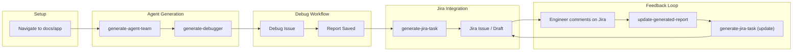
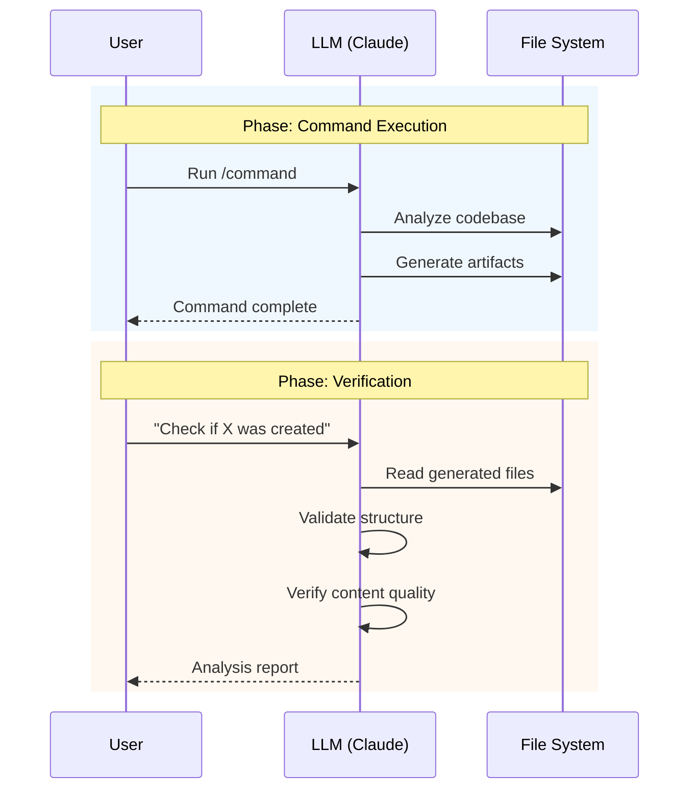
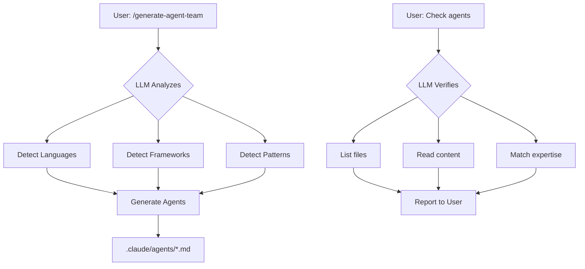
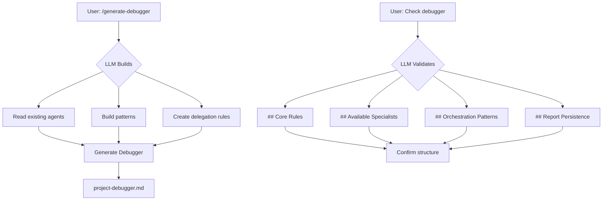
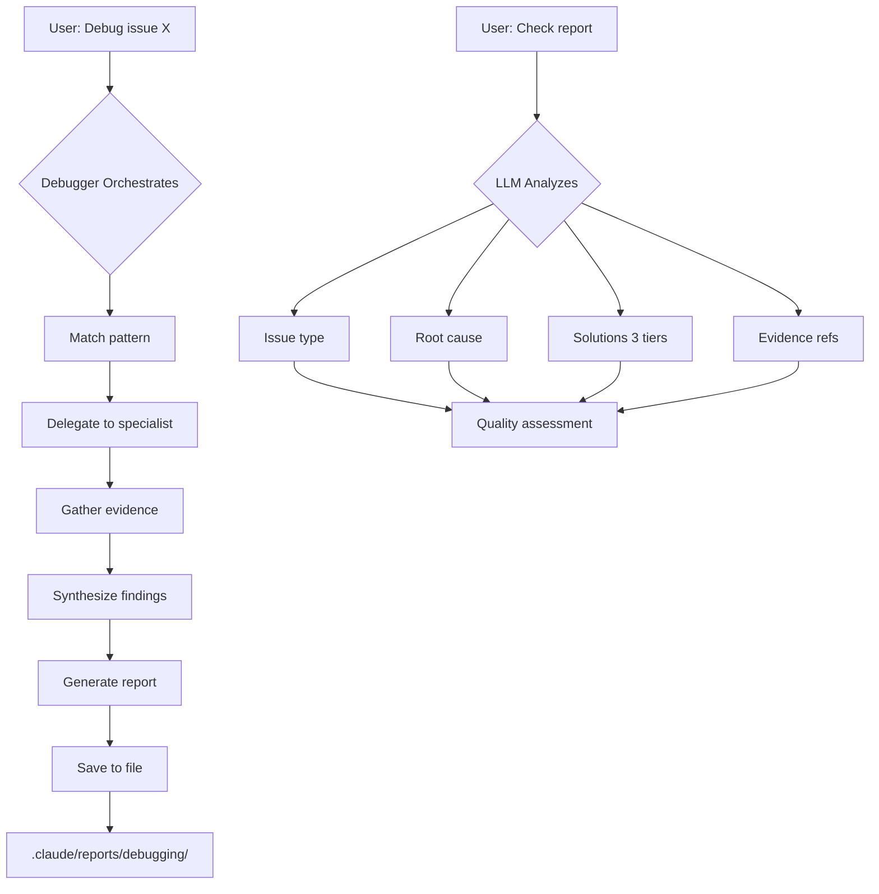
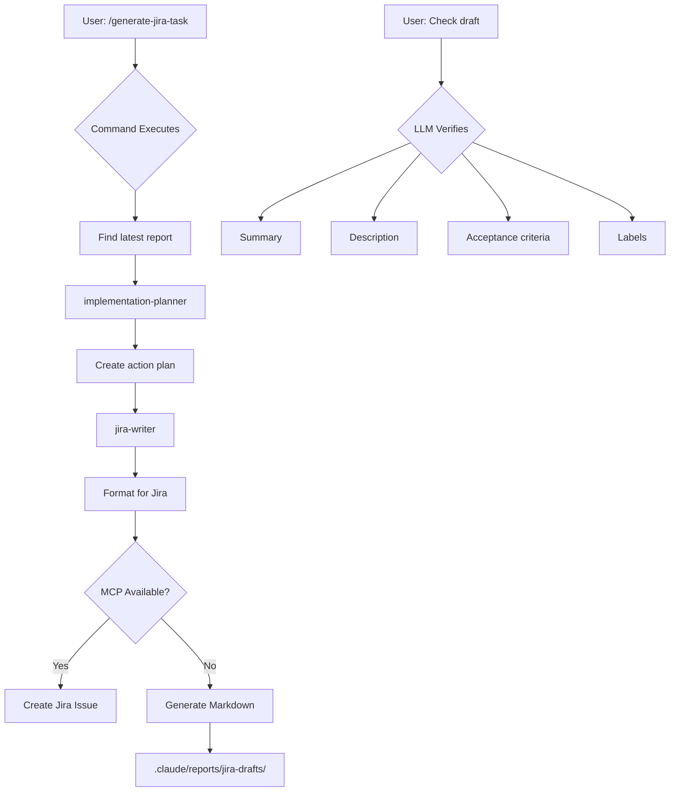
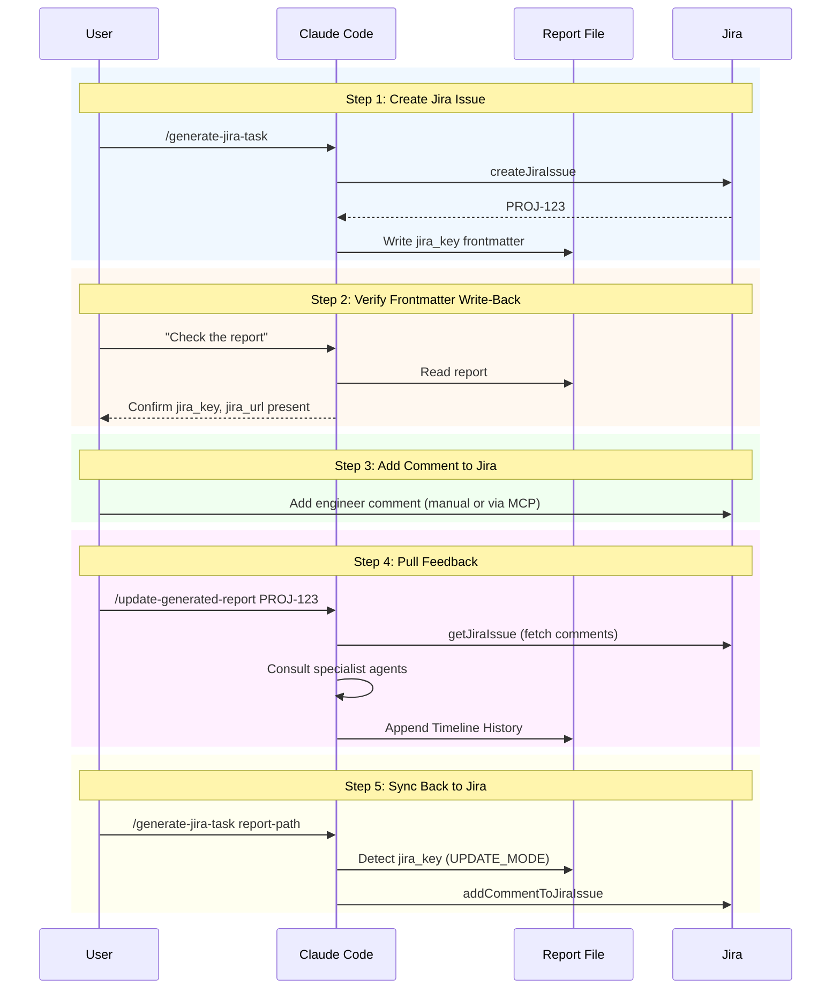
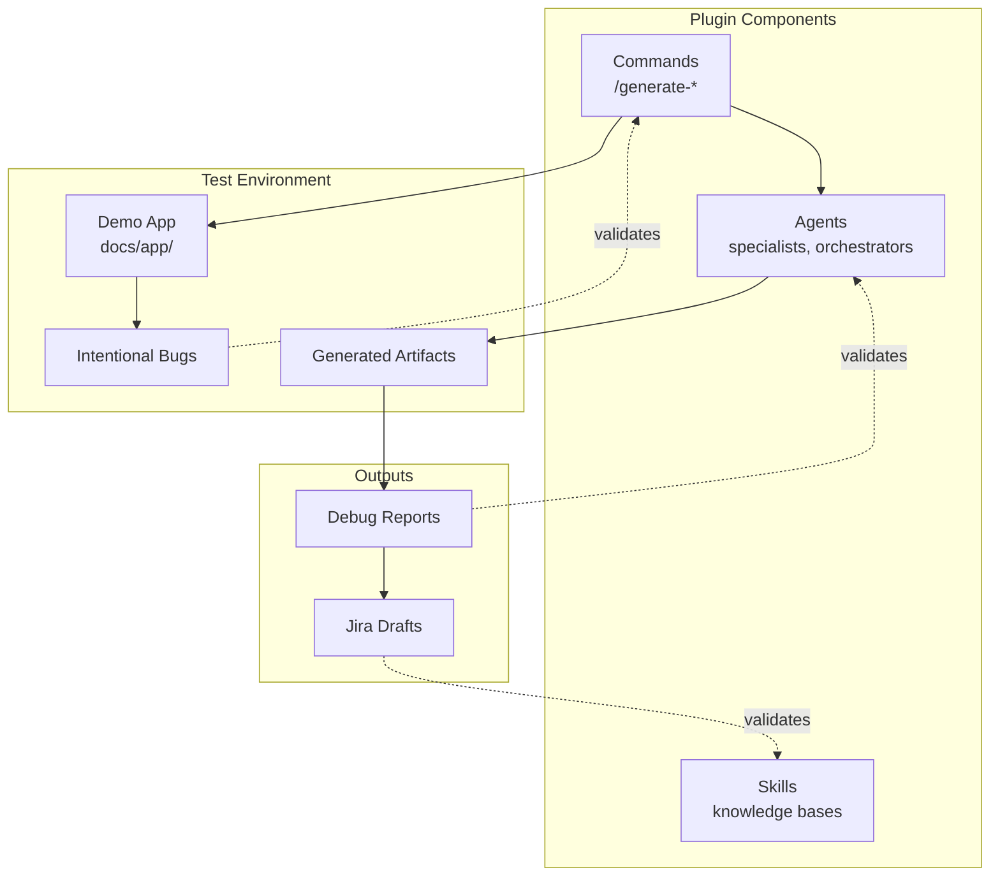
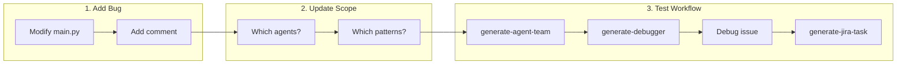
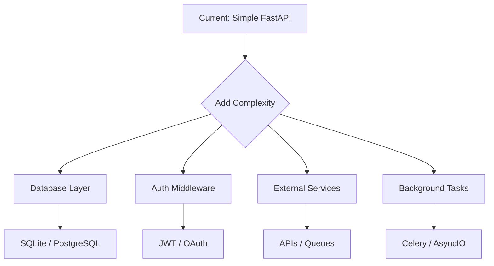

# Plugin Testing & Contribution Guide

> A guide for testing the `agent-team-creator` plugin and contributing new test scenarios.

---

## Quick Start

```bash
cd docs/app
```

Then run commands in Claude Code to test the plugin workflow.

---

## Workflow Overview


```mermaid
flowchart LR
    subgraph Setup
        A[Navigate to docs/app]
    end

    subgraph "Agent Generation"
        B["generate-agent-team"]
        C["generate-debugger"]
    end

    subgraph "Debug Workflow"
        D["Debug Issue"]
        E["Report Saved"]
    end

    subgraph "Jira Integration"
        F["generate-jira-task"]
        G["Jira Issue / Draft"]
    end

    subgraph "Feedback Loop"
        H["Engineer comments on Jira"]
        I["update-generated-report"]
        J["generate-jira-task (update)"]
    end

    A --> B --> C --> D --> E --> F --> G
    G --> H --> I --> J --> G
```

---

## User-LLM Interaction Pattern

This diagram shows the general interaction pattern between user and LLM during testing:


```mermaid
sequenceDiagram
    participant U as User
    participant L as LLM (Claude)
    participant F as File System

    rect rgb(240, 248, 255)
        Note over U,F: Phase: Command Execution
        U->>L: Run /command
        L->>F: Analyze codebase
        L->>F: Generate artifacts
        L-->>U: Command complete
    end

    rect rgb(255, 248, 240)
        Note over U,F: Phase: Verification
        U->>L: "Check if X was created"
        L->>F: Read generated files
        L->>L: Validate structure
        L->>L: Verify content quality
        L-->>U: Analysis report
    end
```

---

## User-LLM Interaction Workflow

This section documents the general interaction pattern when testing plugin features. This workflow applies to any test case.

### Phase 1: Environment Setup

**User action**: Navigate to test environment
```bash
cd docs/app
```

**LLM verification**: None required - user initiates

---

### Phase 2: Generate Specialist Agents


```mermaid
flowchart TD
    A[User: /generate-agent-team] --> B{LLM Analyzes}
    B --> C[Detect Languages]
    B --> D[Detect Frameworks]
    B --> E[Detect Patterns]
    C & D & E --> F[Generate Agents]
    F --> G[.claude/agents/*.md]

    H[User: Check agents] --> I{LLM Verifies}
    I --> J[List files]
    I --> K[Read content]
    I --> L[Match expertise]
    J & K & L --> M[Report to User]
```

**User runs**:
```
/agent-team-creator:generate-agent-team
```

**LLM performs**:
- Analyzes codebase structure (languages, frameworks, patterns)
- Identifies domain boundaries
- Generates specialized agents in `.claude/agents/`

**User verification request**:
> "Check if the agents were created accordingly"

**LLM checks**:
- Lists files in `.claude/agents/`
- Reads each agent file
- Verifies agent expertise matches codebase
- Confirms all expected agents exist

---

### Phase 3: Generate Debugger Orchestrator


```mermaid
flowchart TD
    A[User: /generate-debugger] --> B{LLM Builds}
    B --> C[Read existing agents]
    B --> D[Build patterns]
    B --> E[Create delegation rules]
    C & D & E --> F[Generate Debugger]
    F --> G[project-debugger.md]

    H[User: Check debugger] --> I{LLM Validates}
    I --> J["## Core Rules"]
    I --> K["## Available Specialists"]
    I --> L["## Orchestration Patterns"]
    I --> M["## Report Persistence"]
    J & K & L & M --> N[Confirm structure]
```

**User runs**:
```
/agent-team-creator:generate-debugger
```

**LLM performs**:
- Reads all existing agents
- Builds orchestration patterns based on agent expertise
- Generates `project-debugger.md` with delegation rules

**User verification request**:
> "Check the debugger definition if it makes sense"

**LLM checks**:
- Reads `project-debugger.md`
- Verifies required sections exist:
  - `## Core Rules`
  - `## Available Specialists`
  - `## Debugging Orchestration Patterns`
  - `## Report Persistence`
  - `## Mandatory Output: Debugging Report`
- Confirms specialist table matches generated agents
- Validates orchestration patterns reference real agents

---

### Phase 4: Debug an Issue


```mermaid
flowchart TD
    A[User: Debug issue X] --> B{Debugger Orchestrates}
    B --> C[Match pattern]
    C --> D[Delegate to specialist]
    D --> E[Gather evidence]
    E --> F[Synthesize findings]
    F --> G[Generate report]
    G --> H[Save to file]
    H --> I[.claude/reports/debugging/]

    J[User: Check report] --> K{LLM Analyzes}
    K --> L[Issue type]
    K --> M[Root cause]
    K --> N[Solutions 3 tiers]
    K --> O[Evidence refs]
    L & M & N & O --> P[Quality assessment]
```

**User runs** (example):
```
Debug the email duplicate issue - users can register with the same email
```

**LLM performs**:
- Matches issue to orchestration pattern
- Delegates to appropriate specialist agent(s)
- Gathers evidence with file:line references
- Produces structured debugging report
- Saves report to `.claude/reports/debugging/report-{timestamp}.md`

**User verification request**:
> "Check the report that was created"

**LLM checks**:
- Finds report in `.claude/reports/debugging/`
- Reads report content
- Analyzes:
  - Issue type classification
  - Root cause identification
  - Solution quality (3 tiers)
  - Evidence references

---

### Phase 5: Generate Jira Task


```mermaid
flowchart TD
    A[User: /generate-jira-task] --> B{Command Executes}
    B --> C[Find latest report]
    C --> D[implementation-planner]
    D --> E[Create action plan]
    E --> F[jira-writer]
    F --> G[Format for Jira]

    G --> H{MCP Available?}
    H -->|Yes| I[Create Jira Issue]
    H -->|No| J[Generate Markdown]
    J --> K[.claude/reports/jira-drafts/]

    L[User: Check draft] --> M{LLM Verifies}
    M --> N[Summary]
    M --> O[Description]
    M --> P[Acceptance criteria]
    M --> Q[Labels]
```

**User runs**:
```
/agent-team-creator:generate-jira-task
```

**LLM performs**:
- Finds most recent debugging report
- Invokes `implementation-planner` agent
- Invokes `jira-writer` agent
- Creates Jira issue (or markdown draft in fallback mode)

**User verification request**:
> "Check for the Jira draft created"

**LLM checks**:
- Finds draft in `.claude/reports/jira-drafts/`
- Reads draft content
- Verifies:
  - Summary is concise
  - Description includes code snippets
  - Acceptance criteria are testable
  - Labels are properly formatted

---

### Phase 6: Bidirectional Jira Feedback Loop

This phase tests the v2 features: update mode, YAML frontmatter linking, Jira comment sync, and the `/update-generated-report` command.

> **Prerequisites**: Atlassian MCP plugin must be configured and authenticated. A Jira project accessible to the authenticated user must exist.


```mermaid
sequenceDiagram
    participant U as User
    participant C as Claude Code
    participant R as Report File
    participant J as Jira

    rect rgb(240, 248, 255)
        Note over U,J: Step 1: Create Jira Issue
        U->>C: /generate-jira-task
        C->>J: createJiraIssue
        J-->>C: PROJ-123
        C->>R: Write jira_key frontmatter
    end

    rect rgb(255, 248, 240)
        Note over U,J: Step 2: Verify Frontmatter Write-Back
        U->>C: "Check the report"
        C->>R: Read report
        C-->>U: Confirm jira_key, jira_url present
    end

    rect rgb(240, 255, 240)
        Note over U,J: Step 3: Add Comment to Jira
        U->>J: Add engineer comment (manual or via MCP)
    end

    rect rgb(255, 240, 255)
        Note over U,J: Step 4: Pull Feedback
        U->>C: /update-generated-report PROJ-123
        C->>J: getJiraIssue (fetch comments)
        C->>C: Consult specialist agents
        C->>R: Append Timeline History
    end

    rect rgb(255, 255, 240)
        Note over U,J: Step 5: Sync Back to Jira
        U->>C: /generate-jira-task report-path
        C->>R: Detect jira_key (UPDATE_MODE)
        C->>J: addCommentToJiraIssue
    end
```

#### Step 1: Create Jira Issue from Report

**User runs**:
```
/agent-team-creator:generate-jira-task
```

**LLM performs**:
- Loads most recent debugging report
- Detects no `jira_key` frontmatter → `UPDATE_MODE = false`
- Runs implementation-planner and jira-writer agents
- Creates Jira issue via `createJiraIssue`
- **Writes YAML frontmatter back to source report** with `jira_key`, `jira_url`, `last_synced`

**User verification request**:
> "Check if the report was updated with frontmatter"

**LLM checks**:
- Reads the source report file
- Verifies YAML frontmatter exists at the top of the file:
  ```yaml
  ---
  jira_key: PDE-XX
  jira_url: https://site.atlassian.net/browse/PDE-XX
  last_synced: YYYY-MM-DD...
  ---
  ```
- Verifies the rest of the report content is unchanged
- Confirms the Jira issue exists and has the correct summary/description

#### Step 2: Add Comment to Jira Issue

This simulates an engineer reviewing the Jira task and adding feedback.

**Manual method**: Add a comment directly in Jira UI.

**Programmatic method** (using MCP in a command context):
```
Call addCommentToJiraIssue with:
  cloudId: [from .claude/jira-project.json]
  issueIdOrKey: PDE-XX
  commentBody: "After reviewing the code, I believe the proper fix (Solution 2) is the right approach. The comprehensive fix would require too much refactoring for this sprint. Also, we should check if the soft delete bug on line 169 needs a separate ticket."
```

**Verification**: Check the Jira issue in the browser to confirm the comment appears.

#### Step 3: Pull Jira Feedback into Report

**User runs**:
```
/agent-team-creator:update-generated-report PDE-XX
```

**LLM performs**:
- Detects Jira Key Mode (`PDE-XX` matches regex)
- Calls `getJiraIssue` to fetch issue data and comments
- Finds linked local report via glob/grep for `jira_key: PDE-XX`
- Displays context summary to user
- Asks if user wants to add observations
- Discovers and consults relevant specialist agents
- Constructs Timeline History session
- Appends Timeline History to report
- Updates `last_updated` in frontmatter

**User verification request**:
> "Check the updated report"

**LLM checks**:
- Report now has a `## Timeline History` section at the end
- Timeline session includes:
  - Jira comment summary with author and date
  - Specialist analysis table
  - Impact on diagnosis assessment
- Frontmatter `last_updated` is refreshed
- Original report content is unchanged (appended, not replaced)

#### Step 4: Sync Updated Report Back to Jira

**User runs**:
```
/agent-team-creator:generate-jira-task .claude/reports/debugging/report-2026-02-19-2100.md
```

**LLM performs**:
- Loads report, detects `jira_key: PDE-XX` in frontmatter
- Sets `UPDATE_MODE = true`
- Notifies user: "This report is linked to PDE-XX. Will update existing issue."
- **Skips Phase 3** (duplicate check)
- Runs implementation-planner and jira-writer (for the update content)
- Posts update as a **Jira comment** via `addCommentToJiraIssue` (NOT a new issue)
- Updates `last_synced` in frontmatter

**User verification request**:
> "Check the Jira issue for the update comment"

**LLM checks**:
- No new Jira issue was created (issue count unchanged)
- The existing issue `PDE-XX` has a new comment with the Timeline History findings
- The comment contains only the latest changes (not the full report)
- Report frontmatter `last_synced` was updated

#### Step 5: Verify Backward Compatibility

Test that old reports without frontmatter still work normally.

**User runs**:
```
/agent-team-creator:generate-jira-task .claude/reports/debugging/report-2026-01-04-1430.md
```

**LLM performs**:
- Loads report, detects no YAML frontmatter
- Sets `UPDATE_MODE = false`
- Runs Phase 3 (duplicate check) normally
- Creates a new Jira issue
- **Writes frontmatter back** to the old report (upgrades it)

**User verification**:
- Old report now has `jira_key` frontmatter
- A new Jira issue was created (not an update)

#### Verification Checklist

| Check | Expected |
|-------|----------|
| Report has `jira_key` frontmatter after first `/generate-jira-task` | YAML block at top of file |
| `/update-generated-report PDE-XX` finds linked report | Report located via glob or grep |
| Timeline History appended (not replacing content) | Original sections intact |
| `/generate-jira-task` on linked report enters update mode | "Will update existing issue" message |
| Update posts as comment, not new issue | Issue count unchanged |
| Comment contains only new findings | Not the full report |
| Old reports without frontmatter create new issues | Normal create flow |
| Old reports get frontmatter after first Jira link | Upgraded automatically |
| Fallback mode works when MCP unavailable | Drafts saved to `jira-drafts/` |

---

## Testing REST API Fallback Mode

### Prerequisites

- Python 3.6+ installed (`python3 --version`)
- A Jira Cloud instance with API access
- An API token from https://id.atlassian.com/manage-profile/security/api-tokens

### Setup

Create `.claude/jira-rest-config.json` in the test project:

```json
{
  "baseUrl": "https://your-site.atlassian.net",
  "email": "your-email@company.com",
  "apiToken": "your-api-token",
  "configuredAt": "2026-02-24T10:00:00Z"
}
```

### Script Standalone Tests

Test each action in isolation before testing through commands:

```bash
# Verify authentication
python3 agent-team-creator/scripts/jira_client.py --action verify-auth --config .claude/jira-rest-config.json

# Search projects
python3 agent-team-creator/scripts/jira_client.py --action get-projects --config .claude/jira-rest-config.json --query "test"

# Fetch an issue
python3 agent-team-creator/scripts/jira_client.py --action get-issue --config .claude/jira-rest-config.json --issue-key PROJ-1
```

### Command Integration Test Matrix

| # | Test | JIRA_MODE | How to Trigger | Expected |
|---|------|-----------|----------------|----------|
| 1 | Create via MCP | MCP | Normal Atlassian MCP setup | Issue created via MCP |
| 2 | Create via REST | REST | Uninstall Atlassian MCP plugin, configure REST credentials | Issue created via script |
| 3 | Create offline | OFFLINE | No MCP, no REST config, decline prompt | Markdown draft in `jira-drafts/` |
| 4 | Update via MCP | MCP | Run on report with `jira_key` frontmatter | Comment posted via MCP |
| 5 | Update via REST | REST | Same report, no MCP, with REST config | Comment posted via script |
| 6 | Update offline | OFFLINE | Same report, no MCP, no REST | Update draft in `jira-drafts/` |

### Cascade Verification

1. Have MCP installed and REST config present
2. Run `/generate-jira-task` — verify MCP is preferred (should say "Connected to Jira via MCP plugin")
3. Uninstall MCP, keep REST config
4. Run `/generate-jira-task` — verify REST activates (should say "Connected to Jira via REST API")
5. Remove REST config, decline prompt
6. Run `/generate-jira-task` — verify OFFLINE (should say "Running in offline mode")

### Error Simulation

```bash
# Invalid credentials (exit 1)
echo '{"baseUrl":"https://fake.atlassian.net","email":"x","apiToken":"y"}' > .claude/jira-rest-config.json
python3 agent-team-creator/scripts/jira_client.py --action verify-auth --config .claude/jira-rest-config.json

# Bad project key (exit 4)
python3 agent-team-creator/scripts/jira_client.py --action get-issue-types --config .claude/jira-rest-config.json --project NONEXISTENT

# Missing payload file (exit 2)
python3 agent-team-creator/scripts/jira_client.py --action create-issue --config .claude/jira-rest-config.json --payload-file /nonexistent.json
```

### Security Verification

1. `git status` — verify `.claude/jira-rest-config.json` is not tracked
2. After command runs — verify `.claude/tmp/` contains no leftover payload files
3. `ps aux | grep jira` during execution — verify no credentials in process arguments

---

## Plugin Development Relationship


```mermaid
flowchart TB
    subgraph "Plugin Components"
        CMD[Commands<br>/generate-*]
        AGT[Agents<br>specialists, orchestrators]
        SKL[Skills<br>knowledge bases]
    end

    subgraph "Test Environment"
        APP[Demo App<br>docs/app/]
        BUG[Intentional Bugs]
        GEN[Generated Artifacts]
    end

    subgraph "Outputs"
        RPT[Debug Reports]
        JRA[Jira Drafts]
    end

    CMD --> APP
    APP --> BUG
    CMD --> AGT
    AGT --> GEN
    GEN --> RPT
    RPT --> JRA

    BUG -.->|"validates"| CMD
    RPT -.->|"validates"| AGT
    JRA -.->|"validates"| SKL
```

---

## Creating New Test Scenarios

The demo app in `docs/app/` serves as an extensible test environment. Add complexity by introducing new bugs or features.


```mermaid
flowchart LR
    subgraph "1. Add Bug"
        A[Modify main.py]
        B[Add comment]
    end

    subgraph "2. Update Scope"
        C[Which agents?]
        D[Which patterns?]
    end

    subgraph "3. Test Workflow"
        E["generate-agent-team"]
        F["generate-debugger"]
        G["Debug issue"]
        H["generate-jira-task"]
    end

    A --> B --> C --> D --> E --> F --> G --> H
```

### Adding a New Bug

1. **Modify `docs/app/main.py`**
   - Add a subtle bug with a clear root cause
   - Document the bug in a comment (for reference)

2. **Update the test scope**
   - Consider what agents should detect it
   - Consider what orchestration pattern applies

3. **Test the workflow**
   - Run `/generate-agent-team` (if agents need updating)
   - Run `/generate-debugger` (if patterns need updating)
   - Debug the new issue
   - Generate Jira task

### Bug Categories to Test

| Category | Examples | Detection Difficulty |
|----------|----------|---------------------|
| Off-by-one | Loop bounds, indices | Medium |
| Logic errors | Wrong operator, missing condition | Easy |
| Type issues | Wrong conversion, missing validation | Medium |
| Security | Auth bypass, injection | Hard |
| Performance | N+1 queries, blocking ops | Hard |
| Race conditions | Concurrent access, timing | Very Hard |

### Extending the Demo App


```mermaid
flowchart TD
    A[Current: Simple FastAPI] --> B{Add Complexity}
    B --> C[Database Layer]
    B --> D[Auth Middleware]
    B --> E[External Services]
    B --> F[Background Tasks]

    C --> G[SQLite / PostgreSQL]
    D --> H[JWT / OAuth]
    E --> I[APIs / Queues]
    F --> J[Celery / AsyncIO]
```

---

## Contribution Checklist

When contributing new tests:

- [ ] Bug is realistic (could occur in production code)
- [ ] Bug has a clear root cause identifiable by analysis
- [ ] Bug falls into a defined category
- [ ] Workflow runs successfully end-to-end
- [ ] Generated artifacts are reasonable quality

---

## File Structure

```
docs/
├── TESTING-GUIDE.md          # This guide
└── app/                      # Demo test environment
    ├── main.py               # FastAPI app with test bugs
    ├── requirements.txt      # Dependencies
    └── .claude/
        ├── agents/           # Generated agents
        ├── jira-project.json # Cached Jira project config (after first run)
        └── reports/
            ├── debugging/    # Debug reports (with optional YAML frontmatter)
            └── jira-drafts/  # Jira drafts and update drafts (fallback mode)
```

---

## Commands Reference

| Command | Purpose |
|---------|---------|
| `/agent-team-creator:generate-agent-team` | Create specialist agents for codebase |
| `/agent-team-creator:generate-debugger` | Create debugging orchestrator |
| `/agent-team-creator:generate-jira-task` | Create or update Jira task from debug report |
| `/agent-team-creator:update-generated-report` | Pull Jira feedback into local report |
